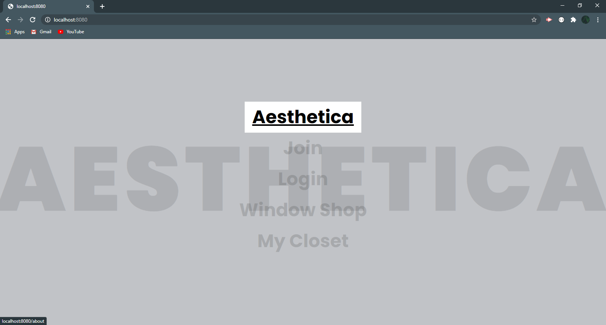
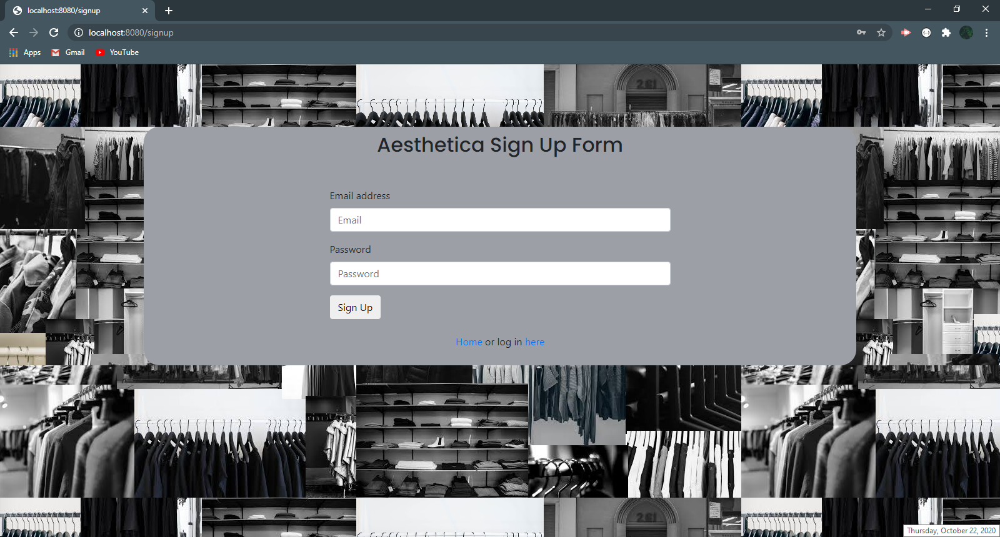

# Aesthetica
<a href="https://secure-ocean-28347.herokuapp.com/" data-text="Aesthetica">Click Here to Visit Aesthetica</a>
 

## Description
Aesthetica is a user friendly and interactive app that bridges fashion and community. Users can build a unique profile secured with a username and password. We tackle the hassle of filtering products based on user’s shopping preferences which can then be pinned to their profile. Aesthetica stands out amongst its competitors by adding a community. Users can talk to like-minded shoppers by leaving comments on their posts.

## Usage
<ul>
<li>Navigate the homepage to create a personal profile.</li>
<li>Browse through the window shopping content and add your favorite images to your own virtual closet.</li>
  <li>Don't be shy to join the conversation and connect with others that shop similar styles.</li>
</ul>
  

 

## Key points in building this application:
<ul>
  <li>utilizes Node & Express server</li>
  <li>utilizes Handlebars.js
  <li>backed by MySQL database with a Sequelize ORM</li>
  <li>utilizes GET & POST routes for retrieving and adding new data</li>
  <li>deployed with Heroku</li>
  <li>utilizes a technology that is new to the creators 
    (incorporates Twilio to send users a welcome message once signed up for the app)</li>
  <li>contains a polished front end/UI</li>
  <li>utilizes a folder structure that meets the MVC paradigm</li>
  <li>utilizes quality coding standards (indentation, scoping, naming)</li>
  <li>API key is protected in Node with environmental variables</li>
</ul>

## Creators
Visit the repositories of the Aesthetica creators: 
[Andres Acosta](https://github.com/acosta-andres-r) 
[Diana Ramos](https://github.com/DianaLRS) 
[Alexandria Robertson](https://www.github.com/alexemrob) 
[Zack](https://github.com/FullStackZack)
